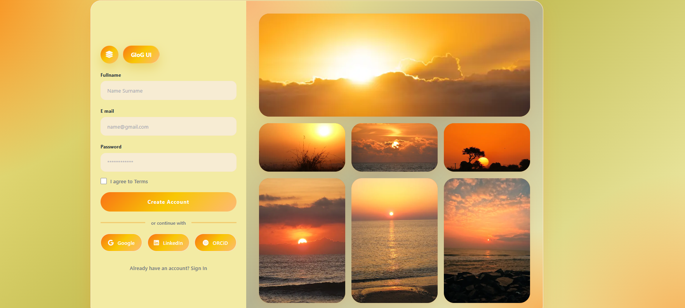

# GloG UI ✨
### Clean & Modern Login/Signup Template

## 🌟 About

GloG UI is a responsive authentication page built with HTML5 and CSS3.  
Perfect for developers who want a beautiful login/signup page without using heavy frameworks.

## ✨ Features
- Responsive Design - Looks great on all devices
- Social Logins - Google, LinkedIn, ORCID buttons
- Beautiful  - Warm gradient + sunset image gallery grid
- Glassmorphism Form - Modern blur effect
- Clean Code - Easy to customize and extend

## 🖼️ Preview
The template includes a signup form with social login options next to a beautiful sunset image gallery.

  
  
  
 Built with HTML & CSS

  
  
  
  

## 🚀 Quick Start 🚀
 Clone the repo
   `bash
   git clone https://github.com/YaSaMaN-Za/glog.git
